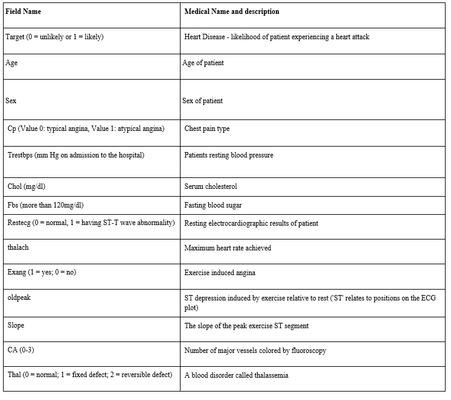

## Health care: Heart attack possibility in Cleveland patients
Immaculate Ezeogbo, Cassidy Fitzpatrick, Hardeep Gill, Muhammad Junaid Saumtally, Xiaoxi Man, Yasser Khan

##### Introduction:

According to the , a heart attack happens every 40 seconds in the United States, making it a leading cause of death among patients. More than 805,000 Americans have a heart attack every year, and in most cases, patients suffer from recurrent heart attacks. Therefore, it is important to understand the leading factors of a heart attack in order to detect and prevent heart attacks.

##### Data Source:

The data source is from Cleveland area hospitals, available on Kaggle, and the direct link is included below. The dataset consists of 14 variables that can be analyzed for the presence of heart disease in patients. 

Link: https://www.kaggle.com/nareshbhat/health-care-data-set-on-heart-attack-possibility

Here's is a table that contains all fourteen variables included in the data set and their description

##### Model and Analysis:

A model was created which included thirteen variables and the target. A logic regression analysis was performed to determine which variables are the best indicators to predict a heart attack. The model was evaluated using the pseudo r-squared, statistical accuracy, MCC, precision, recall, specificity, f-score, confusion matrix, Receiver Operating Characteristic (ROC) and Area Under Curve (AUC). 

##### Conclusion:
From our analysis, common heart attack predictors include: sex, chest pain, exercise-induced angina (exang), the number of major vessels (ca), thalassemia (thal), maximum heart rate (thalach) and the slope of the peak exercise ST segment (slope).

The model is highly sensitive and predicted with 87% accuracy, which makes this model quite reliable. The Area under the ROC curve is 93%.

